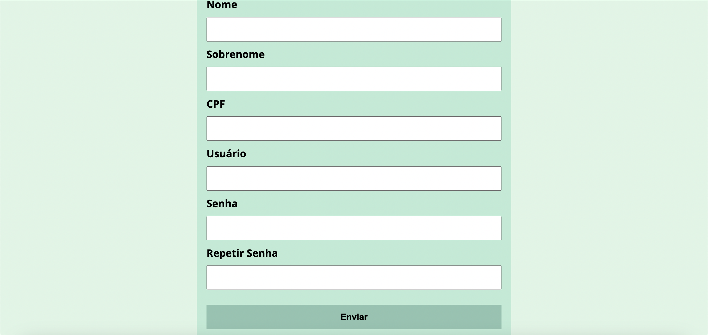

<h1 align="center"> Formulário de Cadastro </h1>

Este é um formulário de cadastro para me ajudar na prática e no aprendizado da programação. 

Link do projeto: https://renansm95.github.io/formulario/

  <a href="#-tecnologias">Tecnologias</a>&nbsp;&nbsp;&nbsp;

  <a href="#-tecnologias">Informações</a>&nbsp;&nbsp;&nbsp;
 

## 🚀 Tecnologias

Esse projeto foi desenvolvido com as seguintes tecnologias:

- HTML
- CSS
- JavaScript
- Git e Github
- Google fonts

---

## Informações

- O projeto apesar de simples, é bem interativo, pois se algum campo estiver vazio, se o usuário não for preenchido apenas com letras e/ou números, se o usuário não tiver no mínimo 3 caracteres e no máximo 12 e a senha precisa ter no mínimo 6 caracteres e no máximo 12, o formulário não é enviado.

---

Feito por Renan Magalhães
